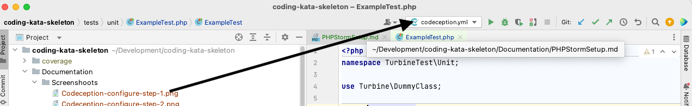
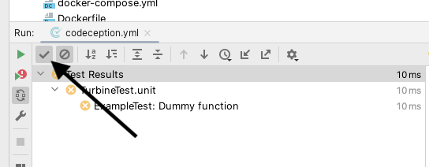

# Running tests from PHPStorm

## Setting up docker

- Tell what docker to use and where is the project mount point in the container, **/app** in our case and set the mapping

## Setting up interpreter

-  add new interpreter

- Select from Docker,Vagrant,VM, WSL, Remote

-  Select docker compose and pick php as a service from dropdown

## Setting up codeception

- go to PHP->Test Frameworks and add a new configuration

- Pick Codeception by Remote Interpreter

- Pick the interpreter from the list

-  Paths should be set automatically

## Running the tests

- To run the test pick codeception run configuration. this will run the whole suite

- you will see the results in run window.

- if you want to see also passing tests do not forget to turn it on

